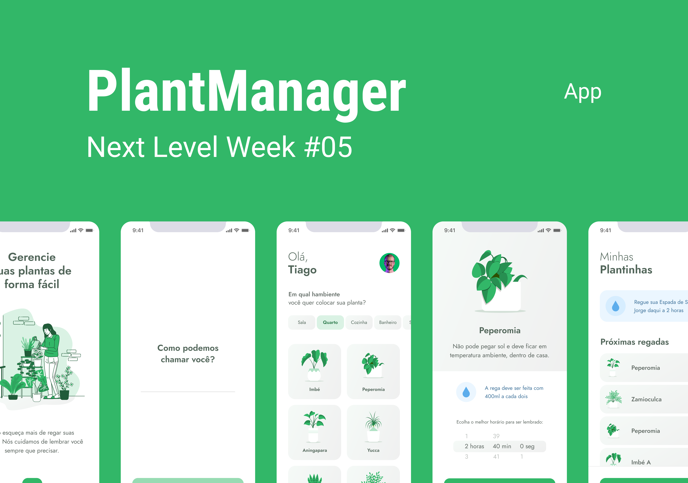

  

## Description
Projeto desenvolvido dentro do NLW#5 - Rocketseat

## Usage

1. Clone repository using by running `$ git clone https://github.com/Luke-Henry-Santos/PlantManager/` in yout terminal
2. Navigate into the directory
3. Install Node JS and NPM or Yarn
4. Run `$ npm i` or `$ yarn` to install the required packages
5. Navigate into the src/services/api.ts and add your IP address in place of yourAndress
6. Connect a device emulator or your own cell phone via USB and run `$ yarn android` (if the device is Android) or `$ yarn ios` (if the device is Ios)
7. Navigate to the packages and modify yourAndress by the same IP address contained in the API and run the server: `$ yarn server`